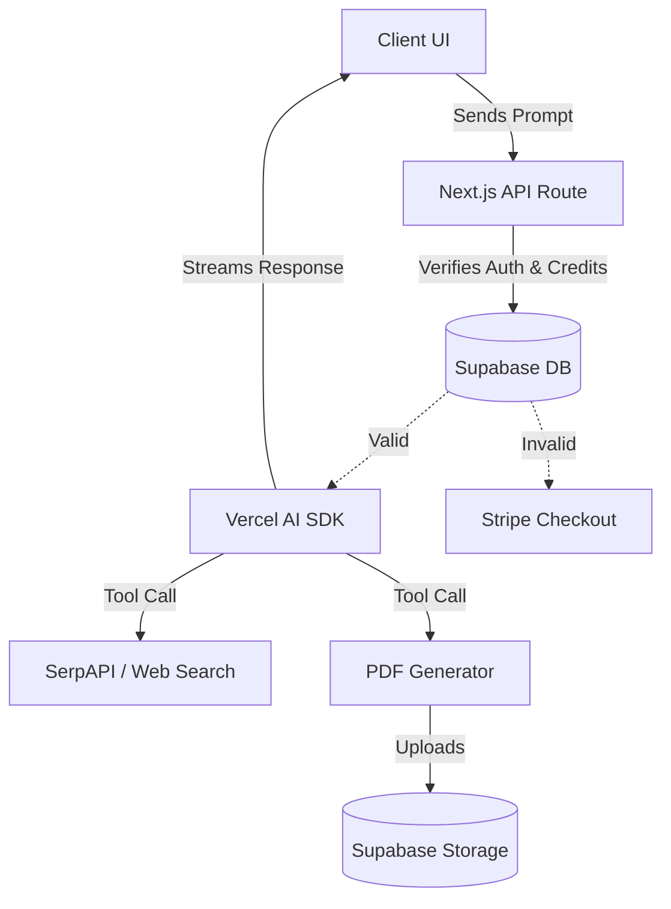

<div align="center">
  
# 🤖 MicroManus

**An autonomous AI research agent with built-in usage-based billing.**

[](https://nextjs.org/)
[](https://react.dev/)
[](https://supabase.com/)
[](https://stripe.com/)
[](LICENSE)

MicroManus bridges the gap between AI capabilities and monetization. It is a full-stack, production-ready template that gives you an intelligent research agent equipped with conversational memory, internet browsing, PDF generation, and a fully functional paywall/credit system right out of the box.

[**Explore Live Demo**](#) • [**Report Bug**](https://github.com/Harsh-karn/MicroManus/issues) • [**Request Feature**](https://github.com/Harsh-karn/MicroManus/issues)

</div>

---

## 📑 Table of Contents
- [✨ Features](#-features)
- [💻 Tech Stack](#-tech-stack)
- [🏛️ Architecture & Workflow](#️-architecture--workflow)
- [📂 Folder Structure](#-folder-structure)
- [🚀 Getting Started](#-getting-started)
- [📝 Usage Examples](#-usage-examples)
- [☁️ Deployment](#️-deployment)
- [🗺️ Roadmap](#️-roadmap)
- [🤝 Contributing](#-contributing)
- [📜 License](#-license)

---

## 📸 Demo & Screenshots

> *Placeholder for GIF/Screenshot showing the AI chatting, searching the web, generating a PDF, and the Stripe paywall.*

---

## ✨ Features

### 💰 Monetization & Auth
* **Stripe Integration**: Complete usage-based billing checkout session and webhook listener.
* **Credit System**: Users receive 5 credits for $5, consumed per agent interaction.
* **Coupon Bypasses**: Apply codes (e.g., `SID_DRDROID`) for 100% discounts during testing.
* **Secure Authentication**: Social logins (GitHub/Google) via Supabase Auth.

### 🧠 AI Capabilities
* **Model Agnostic**: Supports Anthropic (Claude 3.5 Sonnet) and OpenAI (GPT-4o) via Vercel AI SDK.
* **Bring Your Own Key (BYOK)**: Users can configure their own API keys via settings.
* **Web Searching (`web_search`)**: Integrates SerpAPI to autonomously crawl and extract real-time information from Google.
* **PDF Generation (`create_pdf`)**: Leverages server-side Puppeteer to generate and upload formatted research reports to Supabase Storage.
* **Conversational Memory**: Chat threads are securely persisted in Supabase Database.

---

## 💻 Tech Stack

| Category | Technologies |
| :--- | :--- |
| **Frontend** | Next.js 15 (App Router), React 19, Tailwind CSS, Lucide React |
| **Backend** | Next.js Server Actions, Route Handlers, Node.js |
| **Database & Auth** | Supabase (PostgreSQL, Row Level Security, Storage) |
| **Payments** | Stripe (Checkout, Webhooks) |
| **AI / APIs** | Vercel AI SDK, OpenAI, Anthropic, SerpAPI, Puppeteer |

---

## 🏛️ Architecture & Workflow

MicroManus operates on a secure, server-driven architecture to protect API keys and manage user states. 



**Key Design Decisions:**
- **Vercel AI SDK Core**: Normalizes inputs/outputs across OpenAI and Anthropic, allowing effortless model swapping.
- **Server-Side Tool Execution**: API keys for SerpAPI and Supabase Admin are never exposed to the client.
- **Dynamic Stripe Pricing**: The application dynamically generates `price_data` payloads, meaning you don't need to manually configure products in your Stripe dashboard.

---

## 📂 Folder Structure

```text
MicroManus/
├── src/
│   ├── app/                # Next.js App Router (Pages, Layouts, API Routes)
│   │   ├── (chat)/         # Chat interface and dynamic thread routes
│   │   ├── api/            # Server endpoints (AI stream, Webhooks)
│   │   ├── auth/           # Supabase Auth callbacks
│   │   ├── paywall/        # Stripe checkout flow & success states
│   │   └── settings/       # BYOK and model configurations
│   ├── components/         # Reusable React components (Sidebar, Chat UI)
│   └── lib/                # Core business logic and configurations
│       ├── supabase/       # Supabase Client & Server initializers
│       └── tools/          # AI Agent tool definitions (Search, PDF)
├── database_schema.sql     # SQL dump for Supabase DB configuration
└── .env.local              # Environment variables
```

---

## 🚀 Getting Started

### Prerequisites
- **Node.js** (v18.x or newer)
- **Supabase Account** (for Auth and DB)
- **Stripe Account** (for Payments)
- **SerpAPI Key** (for Web Search)

### Installation

1. **Clone the repository:**
```bash
git clone https://github.com/Harsh-karn/MicroManus.git
cd MicroManus
```

2. **Install dependencies:**
```bash
npm install
```

3. **Configure Environment Variables:**
Copy `.env.example` to `.env.local` and populate the keys.

| Variable | Description | Required | Example |
| :--- | :--- | :---: | :--- |
| `NEXT_PUBLIC_SUPABASE_URL` | Supabase project URL | Yes | `https://xyz.supabase.co` |
| `NEXT_PUBLIC_SUPABASE_ANON_KEY` | Supabase public anonymous key | Yes | `eyJhbGciOi...` |
| `SUPABASE_SERVICE_ROLE_KEY` | Supabase admin key for webhooks/storage | Yes | `eyJhbGciOi...` |
| `NEXT_PUBLIC_STRIPE_PUBLISHABLE_KEY`| Stripe client key | Yes | `pk_test_...` |
| `STRIPE_SECRET_KEY` | Stripe backend key | Yes | `sk_test_...` |
| `STRIPE_WEBHOOK_SECRET` | Stripe CLI/Live webhook signing secret | No | `whsec_...` |
| `SERP_API_KEY` | API key for web browsing | Yes | `abc123...` |
| `ENCRYPTION_KEY` | 32-byte base64 string for BYOK encryption | Yes | (Generate via OpenSSL) |

4. **Initialize Database:**
Run the SQL queries found in `database_schema.sql` within your Supabase SQL Editor to provision tables and RLS policies.

5. **Start the development server:**
```bash
npm run dev
```
Open [http://localhost:3000](http://localhost:3000).

---

## 📝 Usage Examples

When interacting with the agent in the chat UI, you can trigger its autonomous tools simply by speaking in natural language.

**Triggering a Web Search:**
> *"Can you search the web for the latest advancements in solid-state batteries?"*

**Triggering a PDF Generation:**
> *"Take all the research you just gathered and compile it into a formal PDF report."*

The agent will seamlessly stream the reasoning process, execute the tools on the server, and provide a downloadable link to the generated document.

---

## ☁️ Deployment

This project is optimized for deployment on [Vercel](https://vercel.com).

1. Push your repository to GitHub.
2. Import the project into Vercel.
3. Add all environment variables from `.env.local` into your Vercel Project Settings.
4. Add your Vercel URL to your Supabase Auth Redirect URLs.
5. Setup a live Webhook in your Stripe Dashboard pointing to `https://your-vercel-domain.com/api/webhook` and update your `STRIPE_WEBHOOK_SECRET` in Vercel.
6. Deploy!

For detailed deployment instructions, refer to [`DEPLOYMENT.md`](./DEPLOYMENT.md).

---

## 🗺️ Roadmap

- [x] Integrate Stripe Checkout and Webhooks
- [x] Configure Supabase Auth and Database RLS
- [x] Implement Vercel AI SDK for generic LLM support
- [x] Build autonomous web search (SerpAPI) and PDF tools
- [ ] Add support for custom Agent personas
- [ ] Implement chunked vector embeddings for long-term semantic memory
- [ ] Add subscription-based recurring billing (currently one-off)

---

## 🤝 Contributing

Contributions are what make the open source community such an amazing place to learn, inspire, and create. Any contributions you make are **greatly appreciated**.

1. Fork the Project
2. Create your Feature Branch (`git checkout -b feature/AmazingFeature`)
3. Commit your Changes (`git commit -m 'Add some AmazingFeature'`)
4. Push to the Branch (`git push origin feature/AmazingFeature`)
5. Open a Pull Request

---

## 📜 License

Distributed under the MIT License. See `LICENSE` for more information.

---

## 📬 Contact

**Harsh Karn**  
[](https://github.com/Harsh-karn)

Project Link: [https://github.com/Harsh-karn/MicroManus](https://github.com/Harsh-karn/MicroManus)
